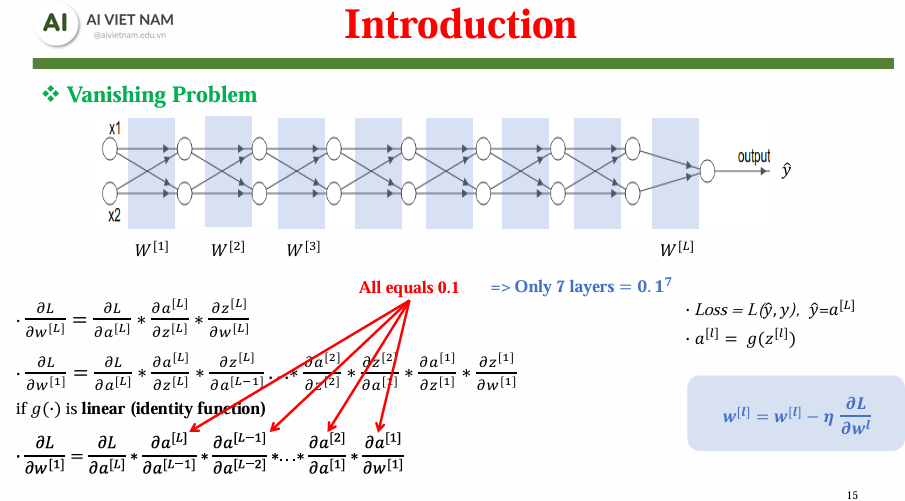
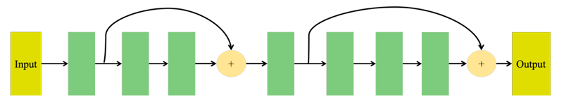
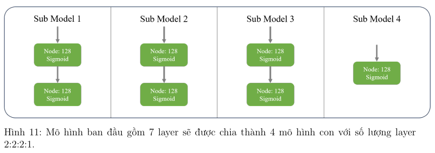
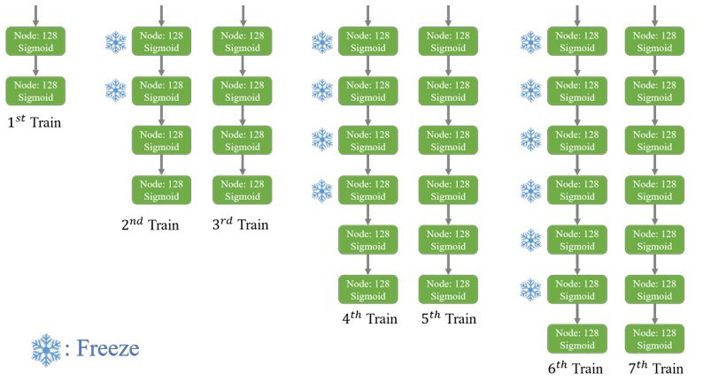

# Project - M05: Vanishing Gradient
**Vanishing Gradient** là một vấn đề thường gặp khi tăng độ phức tạp của mô hình bằng cách thêm nhiều hidden layers (lớp ẩn) nhằm học được các đặc trưng phức tạp hơn từ một tập dữ liệu lớn. Khi mô hình trở nên sâu hơn, trong quá trình lan truyền ngược (backpropagation), giá trị gradient giảm gần qua từng lớp. Điều này dẫn đến các trọng số nhận được rất ít hoặc không có sự cập nhật sau mỗi vòng lặp, khiến mô hình gần như không thể học được

<figure style="display:flex; flex-direction:column; align-items:center;">
    
    <figcaption>Ảnh minh họa vấn đề Gradient Vanishing (Ảnh được lấy từ slide của khóa AIO2024)</figcaption>
</figure>

Vanishing Gradient thường được nhận diện qua một số dấu hiệu: 
- Trọng số của các layer gần output layer thay đổi đáng kể, trong khi trọng số của các layer gần input layer thay đổi rất ít hoặc hầu như không thay đổi.
- Trọng số có thể dần tiệm cận 0 trong quá trình huấn luyện
- Mô hình học rất chậm, quá trình huấn luyện có thể bị đình trệ từ sớm
- Phân phối của trọng số tập trung quanh giá trị 0, hạn chế khả năng truyền tải thông tin qua các lớp mạng

Nguyên nhân chính của Vanishing Gradient xuất phát từ chain rule trong quá trình lan truyền ngược. Gradient của các layer gần input layer giảm dần theo tích gradient qua các lớp trước đó, dẫn đến gần như bằng 0.

### Một số phương pháp cải thiện hiệu quả học của mô hình để giảm thiểu Vanishing Gradient
- ***Weight Increasing***: thay đổi cách khởi tạp trọng số ban đầu để tăng giá trị gradient, từ đó giảm thiếu khả năng gradient trở nên quá nhỏ
- ***Better Activation***: Thử nghiệm các hàm kích hoạt tiên tiến, không bị bão hòa dễ dàng như Sigmoid, nhằm giữ gradient ổn định (ReLU,...)
- ***Better Optimizer***: Sử dụng các thuật toán tối ưu hiện đại hơn để tăng tốc độ hội tụ và giảm thiểu Vanishing Gradient (Adam,...)
- ***Normalize Inside Network***: Áp dụng kỹ thuật chuẩn hóa để giữ giá trị đầu ra trong khoảng ổn định, từ đó giúp gradient không giảm quá nhanh qua các lớp (Batch Normalization)
- ***Skip connection***: Tích hợp các skip connection trong kiến trúc mạng để tạo đường dẫn gradient trực tiếp từ các lớp trước đến các lớp sau, như kiến trúc ResNet đã chứn minh hiệu quả
<figure style="display:flex; flex-direction:column; align-items:center;">
    
    <figcaption>Ảnh minh họa kỹ thuật skip connection (Ảnh được lấy từ slide của khóa AIO2024)</figcaption>
</figure>

- ***Train Layers Separately (Fine-tuning)***: Huấn luyện tuần tự các lớp để giảm thiểu tác động của các lóp sâu hơn đến gradient
<figure style="display:flex; flex-direction:column; align-items:center;">
    
    
    <figcaption>Ảnh minh họa kỹ thuật train layers separately (Ảnh được lấy từ slide của khóa AIO2024)</figcaption>
</figure>

- ***Gradient Normalization***: Chuẩn hóa gradient trong quá trình lan truyền ngược để duy trì giá trị gradient hợp lý
<figure style="display:flex; flex-direction:column; align-items:center;">
    
    <figcaption>Ảnh minh họa kỹ thuật Gradient Normalization (Ảnh được lấy từ slide của khóa AIO2024)</figcaption>
</figure>